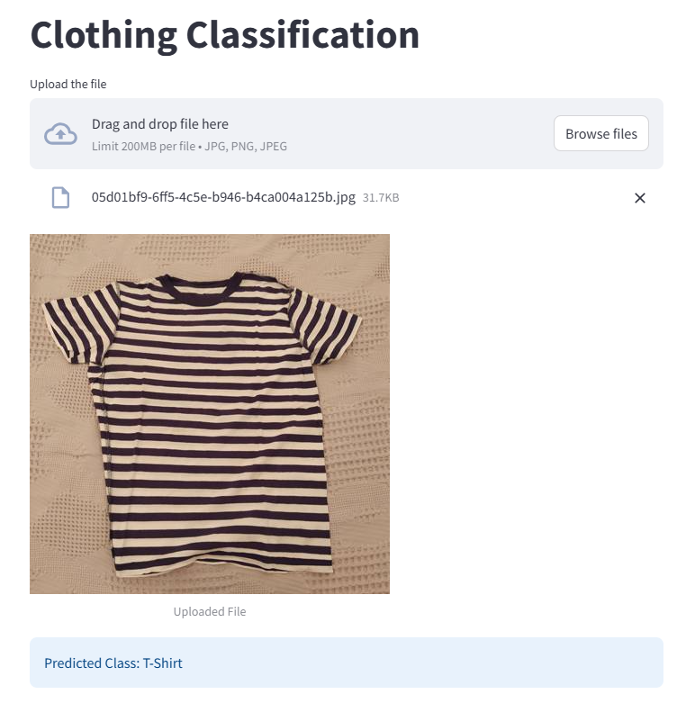

# Clothing Classification App

This app lets you drag and drop an image of a clothing item, and it will tell you what type of clothing it is.




### Model Details
1. Used ResNet50 for transfer learning
2. Model was trained on 1863 images with 5 target classes
   1. Pants
   1. Shirt
   1. Shoes
   1. Skirt
   1. T-Shirt

9. The accuracy on the validation set was around 97%

### Set Up

1. To get started, first install the dependencies using:
    ```commandline
     pip install -r requirements.txt
    ```
   
2. Run the streamlit app:
   ```commandline
   streamlit run main.py"# Clothing-Classification" 
